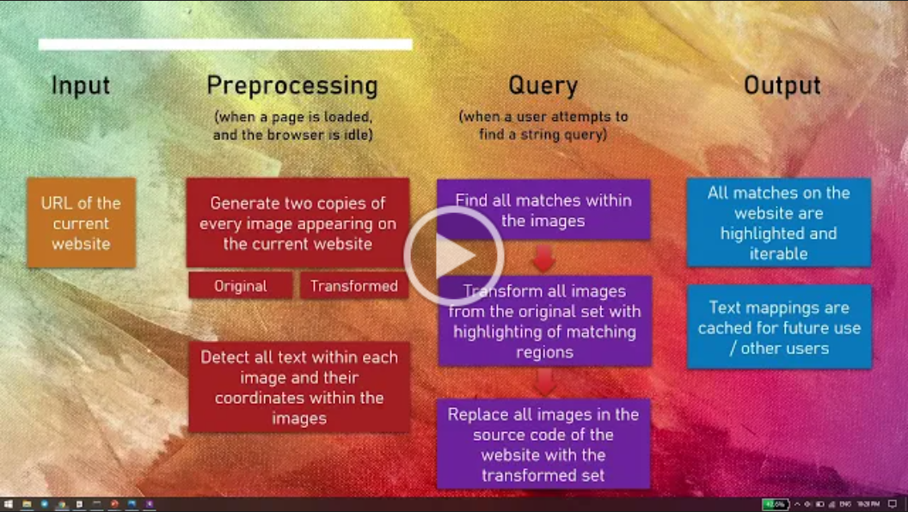

<h1 align="center"> PIC-Search </h1> <br>
<p align="center">
  
</p>
<p align="center">
  Ctrl F Made Easy with Google Image OCR. 
</p>

## Table of Contents

- [Overview](#overview)
- [Quickstart](#quickstart) 
- [Installation](#installation) 
- [Features](#features)
- [Contributors](#contributors)

## 📝 Overview
<p align="center">
  
</p>

## ⚙️ Installation
### Pyenv Setup 
#### Install the virtualenv package 
This package is required to create virtual environments. This can be installed with pip/pip3
```
pip install virtualenv 
```
### Create the virtualenv 
Set up the virtual environment with the following commands, **Do this Within the Project Folder** 
```
virtualenv venv
```
### Activate and Setup the virtualenv 
Mac OS / Linux 
```
source venv/bin/activate 
pip install -r requirements.txt
```
Windows 
```
venv\Scripts\Activate
pip install -r requirements.txt
```
### Deactivate the virtualenv 
```
deactivate
```

## ⚡️ Quickstart 
### Setting up Google OCR API Key


## 🎯 Features

For more in-depth view of the application and its features, refer to this video: 
[](https://drive.google.com/file/d/1-zcvFuJivs6MDGF_jTDzGfZyfx8GC0Fi/view "Milestone 1 Video")


## 🌚 Contributors 
