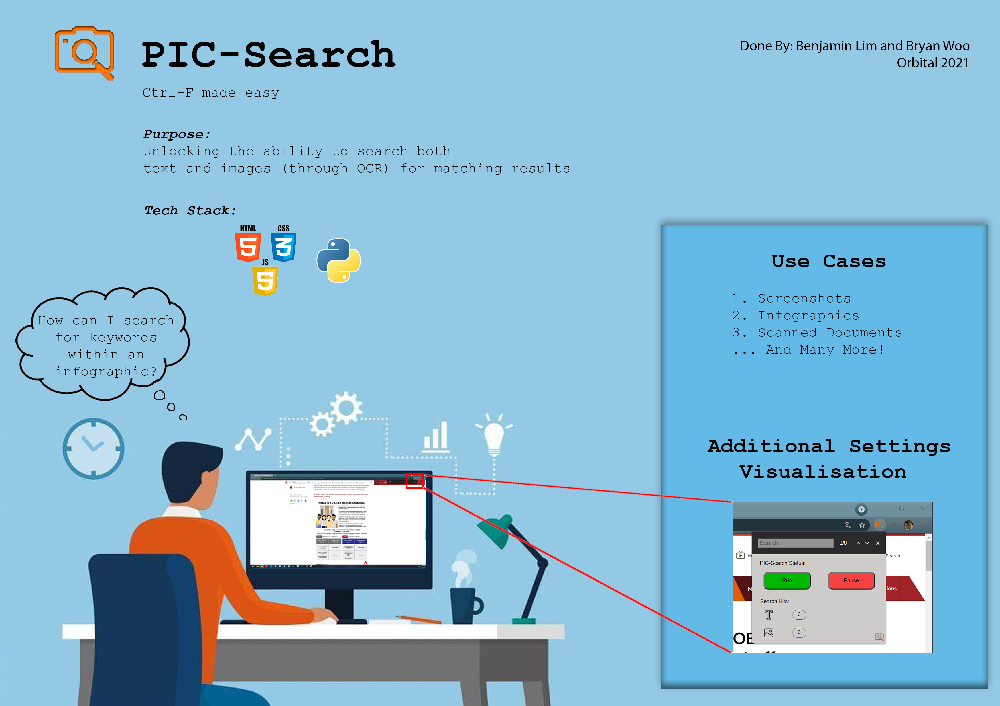

<h1 align="center"> PIC-Search </h1> <br>
<p align="center">
  
</p>
<p align="center">
  Ctrl F Made Easy with Google Image OCR. 
</p>

## Table of Contents

- [📝 Overview](#-overview)
- [🔎 Project Scope](#-project-scope)
- [⚙️ Installation](#%EF%B8%8F-installation)
- [⚡️ Quickstart](#%EF%B8%8F-quickstart)
- [🎯 Application Demo](#-application-demo)
- [🌚 Contributors](#-contributors)

## 📝 Overview
Rapid and intuitive retrieval of information is a goal that developers always strive to achieve in implementations of applications.

Yet, in modern applications such as Chrome and other web browsers, it is often not simple to look for information that is not natively encoded as text.

In particular, searching for text in images from websites can be very difficult and slow, requiring users to manually perform a visual scan through each available image.
We believe that there would be a great increase in the productivity of users if search functions could find matches to text within images, in addition to simple text matching.

The aim is to create an extension for web browsers that provides an enhanced search function to override existing Ctrl+F implementations with a searching algorithm that seamlessly scans through both text and images (through OCR) for matching results.

## 🔎 Project Scope 
### With the use of Python and Google Vision OCR, the project's backend will involve: 
  - Extracting image urls from the given webpage 
  - Text processing, along with individual word/character coordination detection 
  - Highlighting queried keywords, creating a new "transformed" image 
  - Replacing the images on the website with the new "transformed" images 
### With the use of Javascript, HTML and CSS, the project's frontend will involve   
  - Creating a Google Chrome Extension popup which allows for searching functionality to find matches within text and images 
<p align="center">
  
</p>

## ⚙️ Installation
### Pyenv Setup 
#### Install the virtualenv package 
This package is required to create virtual environments. This can be installed with pip/pip3
```
pip install virtualenv 
```
### Create the virtualenv 
Set up the virtual environment with the following commands, **Do this Within the Project Folder** 
```
virtualenv venv
```
### Activate and Setup the virtualenv 
Mac OS / Linux 
```
source venv/bin/activate 
pip install -r requirements.txt
```
Windows 
```
venv\Scripts\Activate
pip install -r requirements.txt
```
### Deactivate the virtualenv 
```
deactivate
```

## ⚡️ Quickstart 
### Backend Setup 
### Setting up Google OCR API Key
Modify the api_key.py to your own api key 
### Run the flask localhost server 
Enter the following commands: 
```
python server.py 
```
### Frontend Setup 
- Enter chrome://extensions 
- Enable Developer Mode 
- Load unpacked, select **templates** folder 
- Activate the Google Chrome Extension

*Will be made available on Google Chrome Web Store upon production release*

## 🎯 Application Demo
For more in-depth view of the application and its features, refer to this video: 
<p align="center">
  <a href="https://drive.google.com/file/d/1cmbXPrkzKYo_QL3bH9DYMNRDgNTzuMyu/view"></a>
</p>

## 🌚 Contributors 
<a href="https://github.com/itzblim/findingnemo/graphs/contributors">
  
</a>
